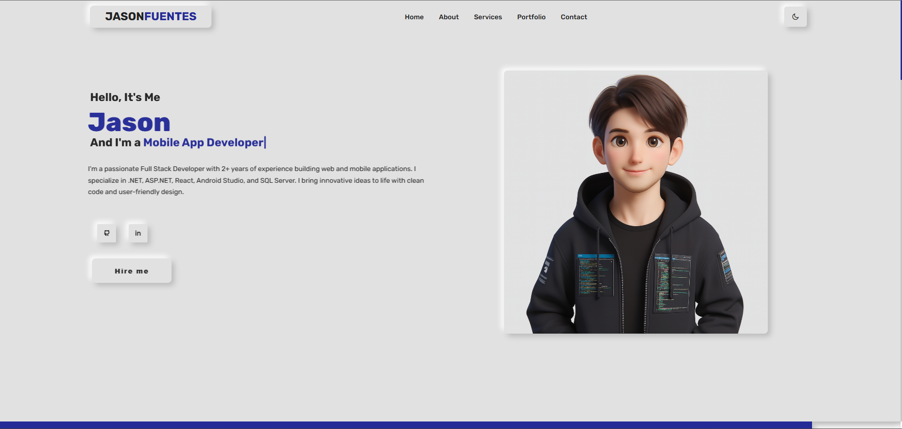
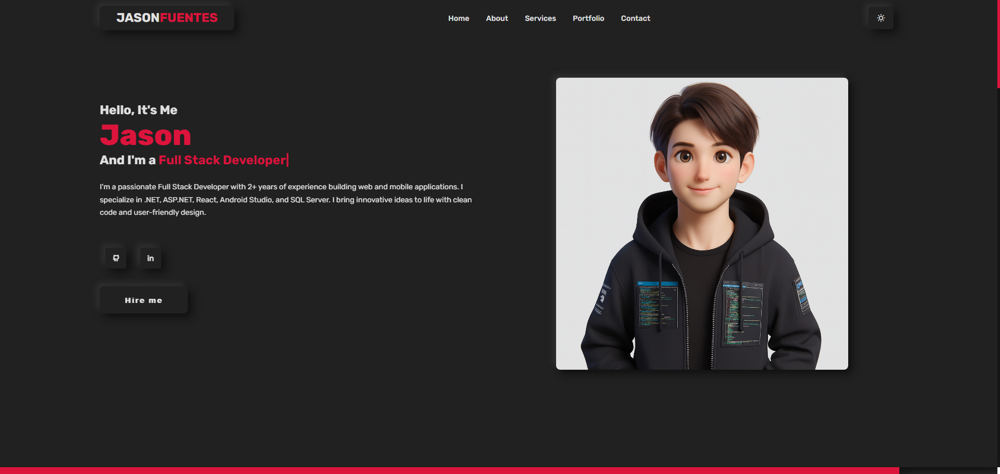

# 💼 Jason Fuentes | Personal Portfolio

Este es mi sitio web de portafolio personal, diseñado para mostrar mis proyectos, habilidades y experiencia como desarrollador Full Stack especializado en aplicaciones web y móviles.

---

## 🔗 Demo en vivo

➡️ [Ver el sitio aquí](https://jasonfuentes.github.io/portfolio-jason-fuentes) 

---

## 🛠️ Tecnologías utilizadas

- C#.
- ASP .NET
- MVC.
- API REST
- REACT
- SQL SERVER
- FIREBASE
- JAVA
- KOTLIN
- ANDROID STUDIO
- HTML,CSS,JAVA SCRIPT
- SWIFT
- WEB SERVICES
---

## 📂 Estructura del sitio

- `Home`: presentación y animación de títulos
- `About`: descripción personal y habilidades técnicas
- `Services`: lista de servicios ofrecidos
- `Portfolio`: proyectos destacados con filtros
- `Testimonial`: opiniones de usuarios
- `Contact`: formulario para contacto directo
- `CV`: botón de descarga para mi currículum

---

## 📸 Captura del sitio

 

---

